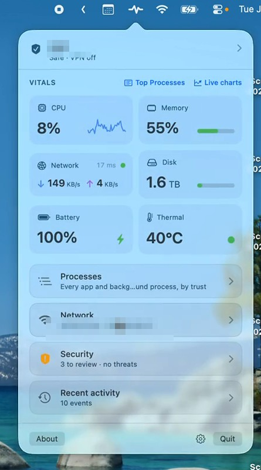
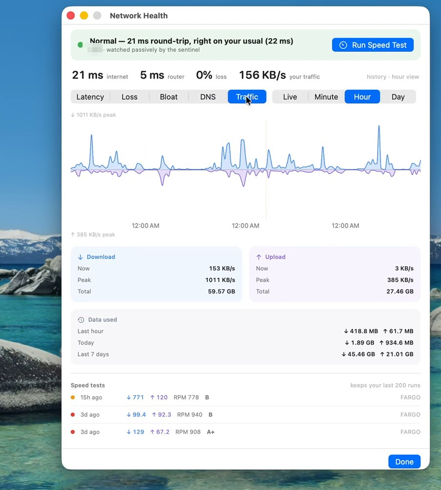

# Mojo Pulse

**A calm menu bar companion that tells you when your Mac needs attention — and stays out of the way when it doesn't.**

**[mojopulse.io](https://mojopulse.io)** · [Download](https://github.com/NativeMojo/mojo-pulse/releases/latest) · [Screenshots](https://mojopulse.io/#screens) · [FAQ](https://mojopulse.io/#faq)


<p align="center">
  
</p>

Mojo Pulse lives in your menu bar as a single colored dot. When everything's fine, the dot stays quiet. When something deserves your attention — a sustained CPU spike, an open Wi-Fi network without a VPN, a thermal throttle, an offline interface, a near-full disk — the dot changes color and a short label appears next to it ("Hot", "Net", etc.). Click the dot to see what's going on and what to do about it.

The design ethos: **incidents shout, vitals whisper**. The popover stays calm by default; problems make themselves obvious without the rest of the UI yelling.

## What it watches

- **CPU** — sustained high utilization, with severity thresholds tuned to avoid noise.
- **Memory** — both used / total and macOS's real "memory pressure" signal.
- **Swap** — when the OS starts paging heavily, you find out.
- **Disk** — root volume free space (using the same accounting Finder and System Settings do, so purgeable space counts).
- **Battery** — low charge, plus IOKit's explicit "service recommended" / "replace now" condition.
- **Thermal** — macOS's own throttling state, surfaced as serious / critical.
- **Network reachability** — distinguishes offline from degraded.
- **Wi-Fi security** — warns when you're on open or weak Wi-Fi without a VPN.
- **VPN status** — a debounced check so brief reconnect handshakes don't flicker the dot.

Each incident card explains what's happening, why it matters, and offers a one-click shortcut to the relevant macOS settings pane or Activity Monitor.

## Live charts

<p align="center">
  
</p>

Click any of CPU, RAM, or Net in the popover to expand a 60-second sparkline inline, or hit **Live charts** at the top of the vitals grid to open a standalone window with a five-minute view, a tabbed switcher, and at-a-glance mini charts for the other metrics. While the popover or detail window is visible, sampling bumps to 2 s for smooth lines — otherwise it runs at the quieter 5 s baseline so battery life isn't impacted.

## Why it's different from Activity Monitor / iStat Menus

Activity Monitor and iStat Menus are great at showing you *everything*, all the time. Pulse is opinionated: it leads with *what's wrong right now* and treats live numbers and graphs as supporting context. Most of the time the menu bar is a single gray dot — only when there's something to know does it speak up.

## Installation

**[Download the latest release →](https://github.com/NativeMojo/mojo-pulse/releases/latest)** — open the DMG and drag `Mojo Pulse.app` into `/Applications`. Every release is signed with an Apple Developer ID and **notarized by Apple**, so it opens with no Gatekeeper warnings. Verify it yourself:

```sh
spctl -a -vv /Applications/MojoPulse.app   # → accepted · source=Notarized Developer ID
```

Or with Homebrew:

```sh
brew install --cask nativemojo/tap/mojo-pulse
```

Toggle **Launch at login** inside the popover so it comes back automatically. More at **[mojopulse.io](https://mojopulse.io)**.

### Requirements

- macOS 15 (Sequoia) or later. Tested through macOS 26 (Tahoe).
- Apple Silicon or Intel.
- Location permission on first run is requested only so Pulse can read the current Wi-Fi SSID (Apple gates SSID access behind Core Location). Your location is never sent off the device.

## Build from source

```sh
# build, install to /Applications, and run
make install
open /Applications/MojoPulse.app

# or build a redistributable DMG into dist/
make dmg
```

The `Makefile` auto-increments `CFBundleVersion` on every build and stores the counter in `.build-number` (gitignored). The marketing version (`CFBundleShortVersionString`) lives in `Info.plist` and is bumped manually for releases.

Useful targets:

| target | what it does |
| --- | --- |
| `make build` | release Swift build, no bundle |
| `make app` | release build + `.app` bundle, ad-hoc signed |
| `make install` | `make app` then copy to `/Applications` |
| `make dmg` | `make app` then wrap in a compressed DMG |
| `make print-version` | show current marketing version + build number |
| `make clean` | wipe `.build/`, `MojoPulse.app`, `dist/` |

## How it works (briefly)

```
ThermalCollector ─┐
                  ├─► SignalAggregator ──► DetectorEngine ──► UI
ReachabilityMon. ─┘     (ticks 5 s,         (dedup +
                         2 s when popover    suppress +
                         or window is open)  persist)
```

- Event-driven collectors (thermal, network reachability) call `forceTick()` so the UI reacts in milliseconds, not seconds.
- The detector engine deduplicates incidents, debounces flapping signals, and writes opens/closes through to a local SQLite log.
- Every incident card has a feedback menu — Dismiss / Snooze 1 hour / Always ignore — and those clicks are stored as labeled data, so the suppression rules can be tuned without ever phoning home.

## License

Mojo Pulse is a product of **NativeMojo LLC**, licensed under the [Apache License 2.0](LICENSE). See [NOTICE](NOTICE) for attribution.

© 2026 NativeMojo LLC. "Mojo Pulse" and "NativeMojo" are trademarks of NativeMojo LLC.
